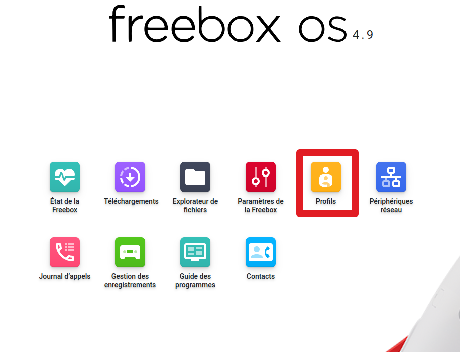
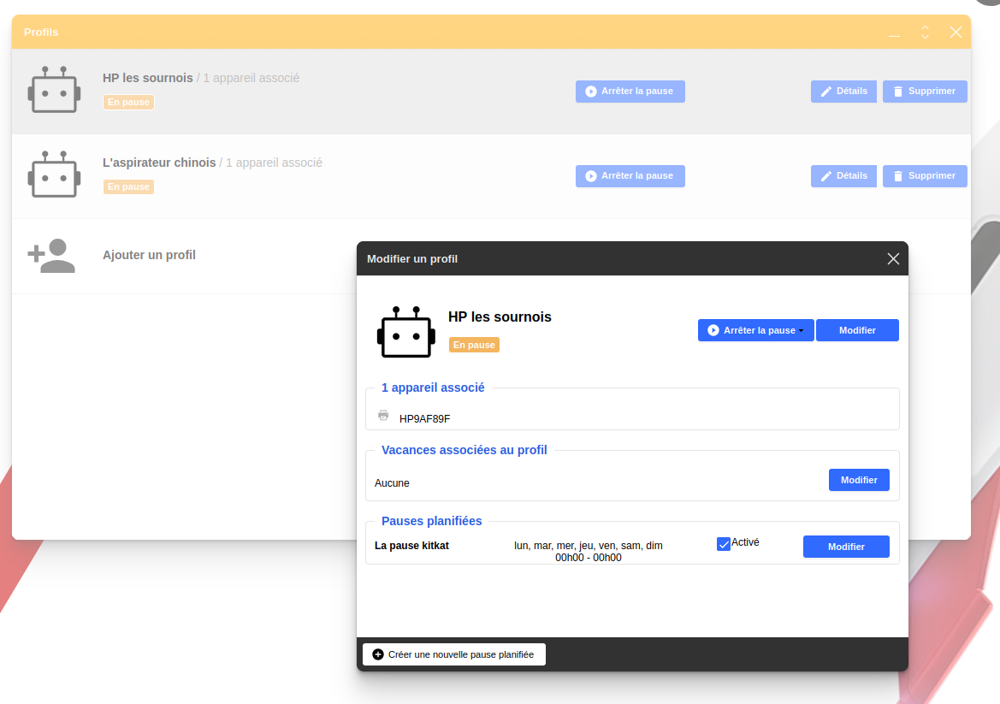

Comme je vous le disais, je fais de la bidouille.

En lisant divers articles sur le net et en voyant les pratiques de HP vis à vis de leur imprimante, à savoir qu'ils [bloquent les imprimantes n'utilisant pas leur cartouche](https://hardware.developpez.com/actu/344505/HP-desactive-les-imprimantes-de-ses-clients-pour-utilisation-des-cartouches-d-encre-d-entreprises-concurrentes-et-le-justifie-par-la-necessite-d-assurer-leur-securite/), j'ai décidé que je devais faire quelque chose. Sinon, mon imprimante risquait de devenir inutilisable.

Le plus simple, si vous êtes sur une configuration assez standard sur votre réseau domestique, avec un routeur fourni par votre fournisseur d'accès internet, c'est de bloquer l'accès à Internet en utilisant l'accès parental ! 

Pourquoi bloquer l'accès à Internet et pas au réseau ? Parce que si vous bloquez le réseau, vous ne pourrez plus accéder à votre imprimante :)

Je vais utiliser ce blog également comme pense-bête pour moi, et j'en profite pour expliquer dans le cas d'une freebox.

Se connecter à votre freebox : https://mafreebox.freebox.fr

Aller dans l'onglet Profil : 

Ensuite, il faut créer un profil. Vous pouvez constater que j'en ai 2, un pour mon robot chinois, qui idem, n'a rien a faire sur internet, et un pour mon imprimante.

Dans ces profils, vous faites qu'ils soient en pause sur toutes les plages horaires, et hop, ils ont accès au réseau local, mais pas à internet !

Le tout, sans avoir un routeur de zinzin.

Ensuite, reste a attendre qu'une imprimante fasse son travail sans tous ces DRM naz qui pollue notre quotidien pour sois disant nous le faciliter.

J'attends de pouvoir passer sur cette [solution complétement open source](https://korben.info/open-printer-imprimante-raspberry-pi-sans-drm.html).